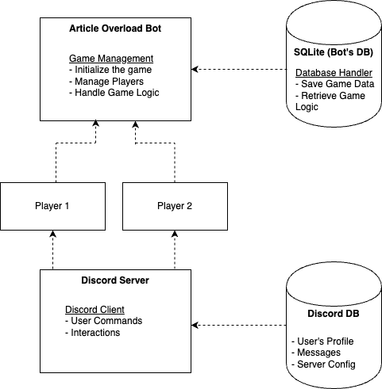

# Python Discord Code Jam 11 - Ascendent Asteroids

## Article Overload: Anti-Cyberwarfare

### Stress Testing the Human Mind
In an era of mass information, we are constantly being inundated with disinformation and misinformation. Now, with large language models that we call AI, we're being swamped by false information, whether it is intentional or not. So what better way to learn how to deal with this than by putting yourself to the test!

In this Discord application, come to battle other players to a game of fast processing, seeing how quickly you can spot the lies in the midst of news. Be wary though, because your opponents can attack you with powerful warfare strategies like DDOS attacks, malware injections, phishing attacks, propaganda, and much more.


### Game Mechanics

 - Overload Ability: Each player has a unique cooldown ability, "CrowdStrike (Cloud Strike)," that can obfuscate the board.
 - News Flash Attack: When hit by the cooldown, players must quickly read and respond to a flashed news article.
 - Propaganda Warfare: Articles serve as attacks, containing hidden messages or links that players must decipher to counter.
 - Masked Titles: Article titles like "XX-YY-ZZZZ" hint at numbers or codes players must find.
 - Option Sets: Players counter attacks by selecting correct summary options of the article, mixing truths and falsehoods (e.g., "Earth is flat, sun isn’t real, birds are drones").

### Psychological Warfare
- Timer Pressure: Players have limited time (e.g., 15 seconds) to respond.
- Flashing Animations: Visual overloads to complicate reading and decision-making.
- Dynamic Options: Answer choices reorder every few seconds to increase difficulty.


### Style: Ruff

It is run with the command `ruff check` in the project root. Because a pre-commit hook is used for this repo, the codebase MUST pass "ruff check".

### Entering the virtual environment

It will change based on your operating system and shell.

```shell
# Linux, Bash
$ source .venv/bin/activate
# Linux, Fish
$ source .venv/bin/activate.fish
# Linux, Csh
$ source .venv/bin/activate.csh
# Linux, PowerShell Core
$ .venv/bin/Activate.ps1
# Windows, cmd.exe
> .venv\Scripts\activate.bat
# Windows, PowerShell
> .venv\Scripts\Activate.ps1
```

#### Installing the dependencies

```shell
pip install -r requirements.txt
```

## System Design

### Technical Features

**Interactive UI**: Uses Discord's interaction components such as buttons and select menus for real-time game interactions.


**AI-Generated Content**: Game content is pre-generated using AI where articles are pulled from free news API sites and then altered by AI to create false and incorrect statements. This pre-generated content is stored in the database, reducing the need for constant real-time AI generation and ensuring cost efficiency, and is randomly selected from the database during gameplay.

**Real-Time Feedback**: Provides real-time updates and feedback to users based on their interactions and game progress, such as score and time available.

**Cog-Based Architecture**: The 'Article Overload' bot is modularized using [Discord.py's Cog System](https://discordpy.readthedocs.io/en/stable/ext/commands/cogs.html)

**SQLite Database**: Utilized for persistent data storage, tracking game sessions, player scores, and article responses

**Asynchronous Operations**: Ensures non-blocking operations for smooth user experience.

**Logging**: Comprehensive logging using Python's logging module to track bot events and errors.

### Architectural Design

The 'Article Overload' bot is built following a 'Cog Based' architecture where game logic is encapsulated in different functionalities aka 'cog'. Cogs in this bot include:

1. **game**: Provides the main game loop, setting up the game and player objects. Interacts with the database to store/retrieve game data. 

2. **user statistics**: Provides commands for the player/user to view statistics such as individual and leaderboards score.

3. **moderation**: Allows management of inbound bot messaging, such as purging of associated game messages

4. **error**: Provides graceful handling of errors that may arise during bot creation.

### Data Design Flow



